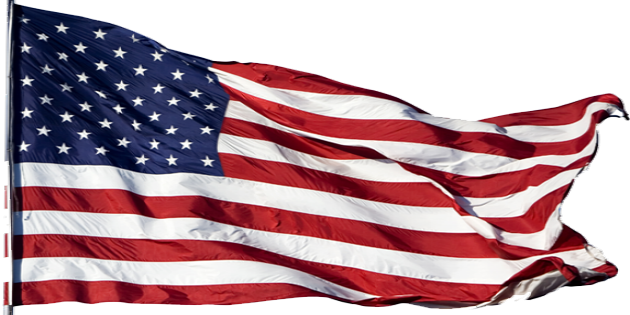
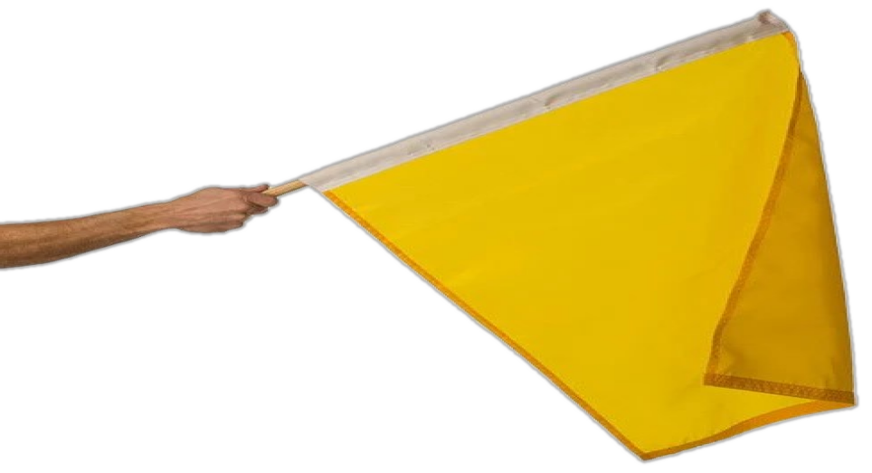
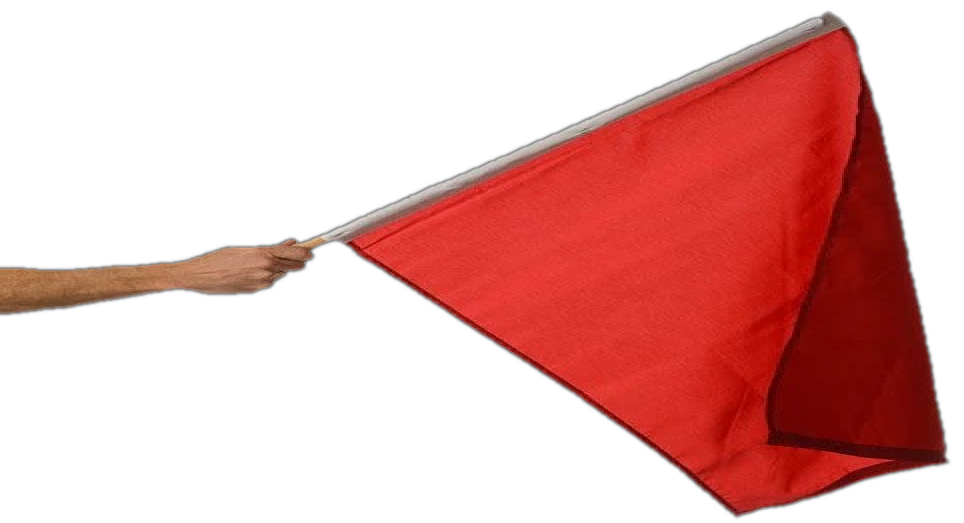
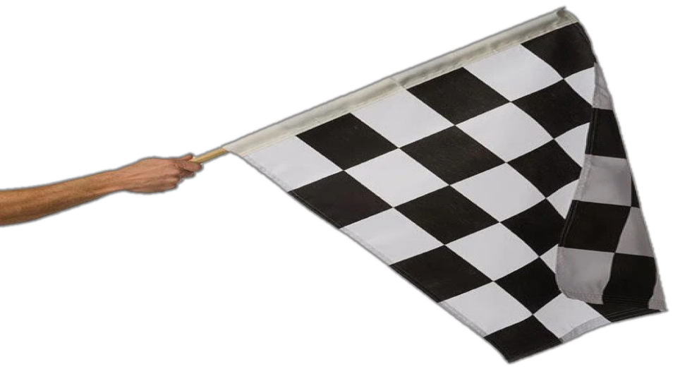
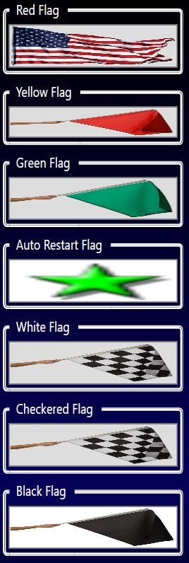

# Creator (July 2025)
Scotty-B

# Info
Alternative flag pack.  It is suggested that these flag files be placed in a separate folder to prevent them being overwritten during a software update.  You can cutomize your choice of flag to display for each situation by selecting the desired flag file locations in the Race Coordinator menu system from the Expert Race Setup>Images tab.

# Waving Flag Pack

## USA Flag

## Racing Flags

## How We Use These Flags - An optional alternative
Some might ask why or how the US flag is used.  Here is a screen capture of the Race Manager, Images configuration menu used by our club.  When a race is not running RC displays the US Flag (RC: Red Flag).  During a race when a track call is initiated and power is shut off to the track thereby stopping all the cars we considered that a red flag (RC Yellow Flag).  A corresponding change to the audio results in the correct announcement.  There is essentially no yellow flag on purpose as in real racing that is where cars would be going slow around the track.

