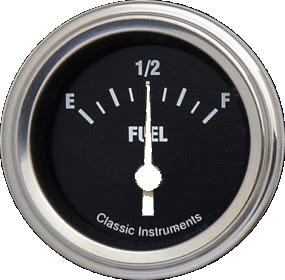

# Creator (July 2018)
unknown <sorry>

#Info
Many of the files in this package can be directly copied over the original RC files. Doing so will cause all your existing configurations (race and driver) to automatically use them. However, this is strongly discouraged. The RC installer will overwrite these files if/when you install a new version of RC and you would have to re-copy them over. It's better to bite the bullet and copy these files to a local directory on your computer, then change your race/driver configurations to point to the new files.

#Sets
##Analog

##Classic

##Digital

##RaceCoordinator Modified

