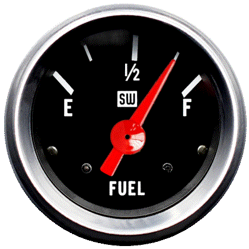
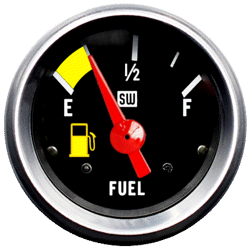
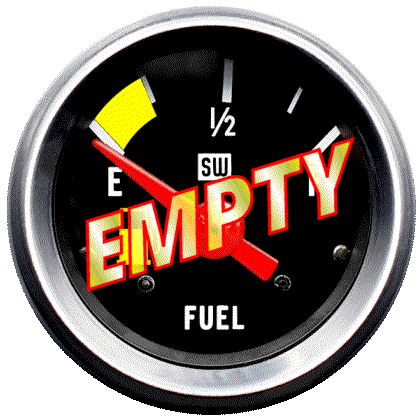

# Creator (July 2025)
Scotty-B

# Info
This fuel gauge provides a realistic appearance with high contrast for easy viewing.  A low fuel symbol and yellow highlight is active from 1/4 tank to empty.

## Stewart-Warner fuel gauge
Three images to illustrate the primary states of the gauge

# SW_fuel-large.psp File
This file was generated using Paint Shop Pro to create all the states needed for the the various positions of the fuel gauge.  It is a layered vector file provided to allow others the ability to make changes the fuel gauge appearance if they desire.  It is not needed by RC.

