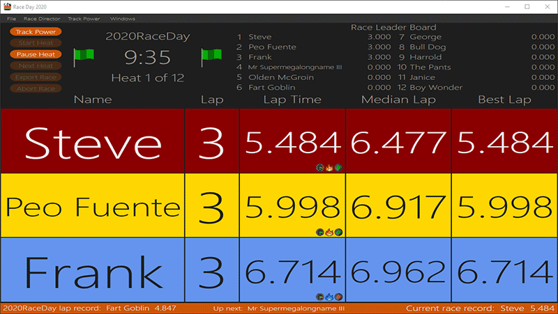
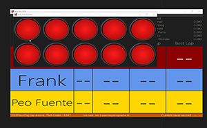
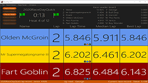
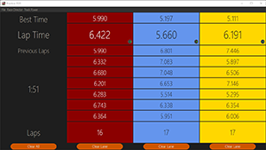
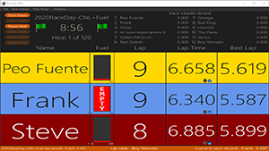
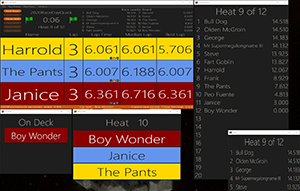
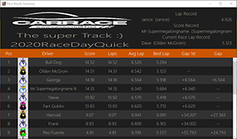
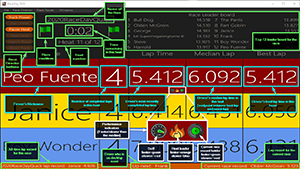
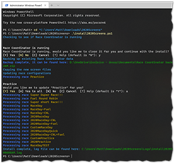
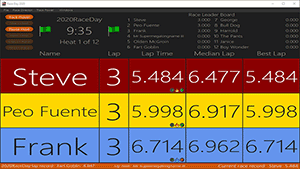

<!-- This content has been moved here from the https://github.com/MattB12/2020RacedayScreens repo-->
<!-- TODO: Move images and audio from this folder to the correct place in the RaceCoordinatorCommunity repo -->

# 2020 Race Day Screens

## Race Coordinator

These screen/XAML files, and their supporting files, make up a modernised *Race Coordinator* skin/theme using modern font and colours, and by removing gradients to create a flatter look. In addition the race day screen layout has been changed to have more race information available on the one screen.

## Screen Shots

## Downloading

To download the 2020 Race Day Screens, [click here](Release/2020Screens_1.0.zip).

## Installation

There are two options for installation, [manual](#manual-installation) and [automated](#automated-installation).  Automated is the easiest way to install the 2020 Screens, however it utilises a PowerShell script that you should not be comfortable in running.  The Manual method will allow you to maintain more control, but will take longer, especially if you have a large number of races to configure.

### Extract the files

1. Using *Windows Explorer*, locate the **2020Screens_x.x.zip** file you have downloaded.
2. **Right-click** the file and select **Extract All...**.
3. Select a suitable location to extract to (the default is usually fine) and click the **Extract** button.
4. Once extraction is complete, you should have the following directories extracted:
   - Audio
   - Images
   - Languages
   - XAML

### Manual Installation

#### Installation overview

- Copy the new screen files (some will need to overwrite existing files)
- Copy the custom.json file
- Copy the new images
- Copy the new audio files
- Update the race configurations

#### Manual installation prerequisities

- Before starting this procedure, please close *Race Coordinator* if it is running
- You will need to know where *Race Coordinator* is installed to, the default locations are:
  - 32-bit OS install location:  C:\Program Files\*Race Coordinator*
  - 64-bit OS install location:  C:\Program Files (x86)\*Race Coordinator*
  - Data location:  C:\ProgramData\*Race Coordinator*
- It is highly recommended to backup your existing *Race Coordinator* install before performing any steps below.
  - A backup can be performed by simply copying the install and data directories (default locations are listed above) to a safe location

#### Copy the screen files

1. Copy *all the files* from the extracted *XAML* directory to the **data\xaml** directory in your *Race Coordinator* install location
2. **Delete** the following files from the **data\xaml** directory in your *Race Coordinator* install location (hopefully you have made a backup as recommended above)
   - Leaderboard.xaml
   - NextHeat_*L.xaml (e.g. NextHeat_1L.xaml, NextHeat_2L.xaml etc.)
   - OnDeck_*L.xaml (e.g. OnDeck_1L.xaml, OnDeck_2L.xaml etc.)
   - RaceResults.xaml
   - Top5.xaml
3. **Rename** the following existing files in the **data\xaml** directory in your *Race Coordinator* install location
   - 2020Leaderboard.xaml  -->  Leaderboard.xaml
   - 2020NextHeat_*L.xaml  -->  NextHeat_*L.xaml  (e.g. 2020NextHeat_1L.xaml  -->  NextHeat_1L.xaml etc.)
   - 2020OnDeck_*L.xaml  -->  OnDeck_*L.xaml  (e.g. 2020OnDeck_2L.xaml  -->  OnDeck_2L.xaml etc.)
   - 2020RaceResults.xaml  -->  RaceResults.xaml
   - 2020Top5.xaml  -->  Top5.xaml

#### Copy the custom.json file

1. Copy *custom.json* from the extracted Languages directory to the **data\Languages** directory in your *Race Coordinator* install location.

Note: If you already have a custom.json file in your data\Languages directory, you will need to manually merge the contents of the two files. |
------------------------- |

#### Copy the images

1. Copy *all the files* from the extracted *Images* directory to the **data\images\ui** directory in your *Race Coordinator* install location.

#### Copy the audio files

1. Copy *all the files* from the extracted **Audio\Man** directory to the **data\audio\english\man**  directory in your *Race Coordinator* install location.  Replace existing files if prompted.
2. Copy *all the files* from the extracted **Audio\Woman** directory to the **data\audio\english\woman**  directory in your *Race Coordinator* install location.  Replace existing files if prompted.

#### Update the race configurations

1. Launch *Race Coordinator*
2. For ***each of the races you use***, perform these steps:
   1. On the *right side* of the *Race Manager* screen, under *Current Races*, **click the name** of the race you want to update
   2. On the *left side* of the *Race Manager* screen, **click the UI button**
   3. Update the following settings:
      - *Race Day XAML File Prefix*:  **data\xaml\2020RaceDay\_** (for a practice race, enter **data\xaml\2020Practice\_** instead)
      - *Race Start XAML File*:  **data\xaml\2020RaceStart.xaml**
      - *Restart XAML File*:  **data\xaml\2020RaceStart.xaml**
   4. **Click** the **Update > >** button, then click the **Images** button
   5. For all the flag images, perform the following:
      1. Click the old **Flag** image
      2. Navigate to the **data\images\ui** directory in your *Race Coordinator* install location
      3. Click the appropriate flag file, then click **Open**.
      - Note: Naming of the flag images is as follows:

         Flag Colour | Filename
         ----------- | --------
         Red         | 2020Flag_Red.png
         Yellow      | 2020Flag_Yellow.png
         Green       | 2020Flag_Green.png
         White       | 2020Flag_White.png
         Checkered   | 2020Flag_Checkered.png
         Black       | 2020Flag_Black.png

   6. Click the old **Drift Lap** image
   7. Navigate to the **data\images\ui** directory in your *Race Coordinator* install location
   8. Click **2020Flag_Black.png** (it may be displayed as just **2020Flag_Black**), then click **Open**
   9. If this race is a fuel race, perform the following:
      1. Click the old **fuel indicator** image
      2. Navigate to the **data\images\ui directory** in your *Race Coordinator* install location
      3. Click **2020Fuel_0.png** (it may be displayed as just **2020Fuel_0**), then click **Open**
   10. For all the Performance images, perform the following:
       1. Click the old **Performance image**
       2. Navigate to the **data\images\ui** directory in your *Race Coordinator* install location
       3. Click the appropriate **performance image** file, then click **Open**.
       - Note:  Naming of the performance images is as follows:

         Performance Image      | + Filename  | - Filename
         ---------------------- | -------- | --
         Self                   | 2020PerformanceSelf01+.png | 2020PerformanceSelf01-.png
         Heat Leader            | 2020PerformanceHL01+.png | 2020PerformanceHL01-.png
         Heat Leader (option 2) | 2020PerformanceHL02+.png | 2020PerformanceHL02-.png
         Race Record            | 2020PerformanceRR01+.png | 2020PerformanceRR01-.png
         Race Record (Option 2) | 2020PerformanceRR02+.png | 2020PerformanceRR02-.png

3. Start racing...

### Automated Installation

#### Automated installation prerequisities

- Administrator privilege is required to access the *Race Coordinator* files and database
- Before starting this procedure, please close *Race Coordinator* if it is running
- PowerShell is required to run the automation script
  - PowerShell is automatically installed on Windows 7 and above
  - PowerShell can be installed manually on Windows XP
- It is highly recommended to backup your existing *Race Coordinator* install before performing any steps below.
  - A backup can be performed by simply copying the install and data directories (default locations are listed above) to a safe location
- PowerShell modules that will be installed automatically if not present:
  - The NuGet package provider:  Required to install the SQLite module
  - PSSQLite: SQLite module required to interact with the *Race Coordinator* database

Note: A PowerShell script is a very powerful thing, especially when run with Administrator privilege.  You should never run a PowerShell script on your computer unless you read through the script and understand what it is doing, or you trust the source of the script. |
------------------------- |

#### Run the PowerShell script

1. Click *Start*, find *PowerShell* (it may be called *Windows PowerShell*), **right-click** it and select **Run as administrator**.
   - If you get a *User Account Control* prompt, click **yes**.
2. **Change** to the **directory** where you have extracted the *2020Screens.zip* file.
3. Type **.\install2020Screens.ps1** then press **enter**.
   - If you get a *...install2020Screens.ps1 cannot be loaded...* error when running the script, type **Set-ExecutionPolicy -ExecutionPolicy Unrestricted -Scope Process** and press **enter**, then repeat step 3.
4. If *Race Coordinator* is running you will be prompted for the script to close it before continuing, there are three options:
   - **Yes:**  The script will force Race Coordinator to close, then continue.  Type **y** then press **enter** to select this option.
   - **No (default):**  The script will wait for you to close Race Coordinator, then select OK to continue.  Press **enter** or type **n** then press **enter** to select this option.
   - **Cancel:**  The script will exit and no further installation steps will be done.  Type **c** then press **enter** to select this option.
5. During the *Updating race configurations* phase, you will be prompted to update each race in the *Race Coordinator* database, you will have four options:
   - Yes (default):  The script will update this race configuration, then prompt for the next one.  Press **enter** or type **y** then press **enter** to select this option.
   - Yes to all:  The script will update this race configuration, then update the remaining race configurations witout prompting again.  Type **a** then press **enter** to select this option.
   - No:  The script will skip this race configuration, then prompt for the next one.  Type **n** then press **enter** to select this option.
   - Cancel:  The script will exit and no further installation steps will be done.  Type **c** then press **enter** to select this option.
> [!NOTE]  
> A Race Coordinator instance which has had it's database modified by this script will not be supported.
6. Close the PowerShell window.
7. Start racing...

## Maintenance

Some of the installation steps above required overwriting some of the original *Race Coordinator* files, a *Race Coordinator* update may reset these files back to their original state.
If that happens:

Note: The reason why the install is so complicated is to avoid this behaviour, however, there are a few file replacements we cannot avoid. |
------------------------- |

### Manual Maintenance

1. If necessary, repeat the [Extract the files](#extract-the-files) section above
2. Repeat the [Copy the screen files](#copy-the-screen-files) section above (specifically the five named files in that section)
3. Repeat the [Copy the audio](#copy-the-audio) files section above

### Automated Maintenance

1. If necessary, repeat the [Extract the files](#extract-the-files) section above
2. Repeat the [Run the PowerShell script](#run-the-powershell-script) section above

## Changing the Theme

There are three colour themes included, two dark themes: *Burnt Orange* (the default) and *Dark Seafoam Green*, and one light theme: *Dark Seafoam Green*.

To change the theme, follow these steps:

1. Close *Race Coordinator*
2. Navigate to the **data\xaml** directory in your *Race Coordinator* install location (see [Manual installation prerequisities](#manual-installation-prerequisities) for information on the install location)
3. **Delete** the **2020ThemeDictionary.xaml** file (or rename it if you are not comfortable deleting it)
4. **Copy** and **paste** back into the **same directory** the file for the theme you would like to use, this will create a *2020ThemeDictionary-xxxxxd - Copy.xaml* file
   - e.g. *2020ThemeDictionary-Dark-DarkSeafoamGreen.xaml* would get copied to *2020ThemeDictionary-Dark-DarkSeafoamGreen - Copy.xaml*
   - Note, the theme files are named as follows:

      Theme                      | Filename
      -------------------------- | -----------------------------------------------
      Dark - Burnt Orange        | 2020ThemeDictionary-Dark-BurntOrange.xaml
      Dark - Dark Seafoam Green  | 2020ThemeDictionary-Dark-DarkSeafoamGreen.xaml
      Light - Dark Seafoam Green | 2020ThemeDictionary-Light-DarkSeafoamGreen.xaml

5. **Rename** the copied file to **2020ThemeDictionary.xaml**
