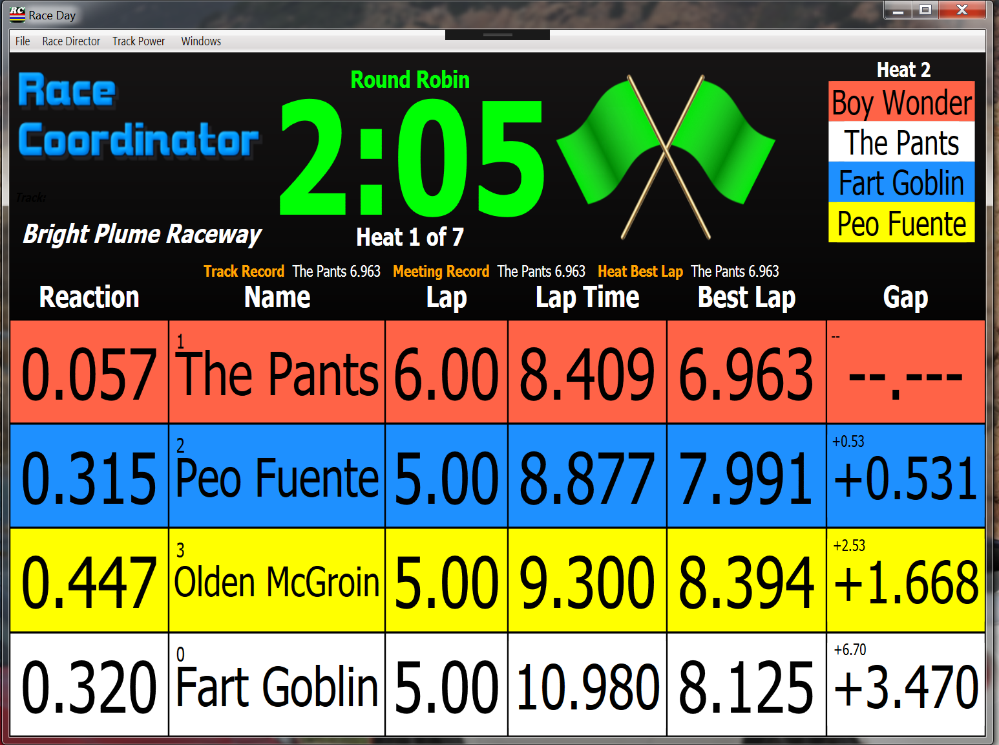
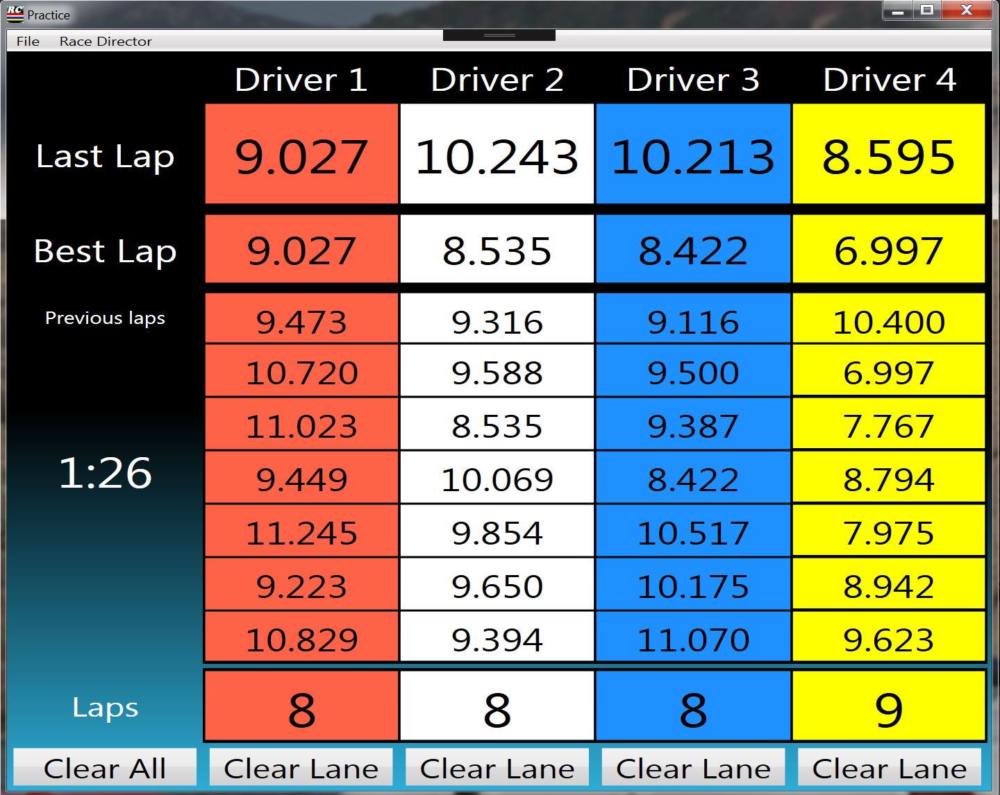

# Creator (November 2018)
TopDown and CHORC

# Info
* 4 Lane Race Day screen
* 4 Lane Race Day screen with large timing and black header
* 4 Lane Practice

## _RD
Each of these 3 xaml files require custom text to display properly.  Simply copy the include [custom.json](./custom_text/custom.json) file to your <install directory>/data/Languages directory.  If you already have a custom.json file you should add these entries into your existing custom.json file so you do not overwrite your existing customizations.

To find your <install_dir> simply go to the Race Day Setup screen and use the File->Open Install Folder menu option.  

# Screens
## Race Day

[Race Day 4 Lane](./xaml/CHORCRaceDay_4L.xaml)

## Race Day (Large timing)

[Race Day 4 Lane Large Black](./xaml/CHORCRaceDayLargeBlack_4L.xaml)

## Practice

[Practice](Practice_4L.xaml)

