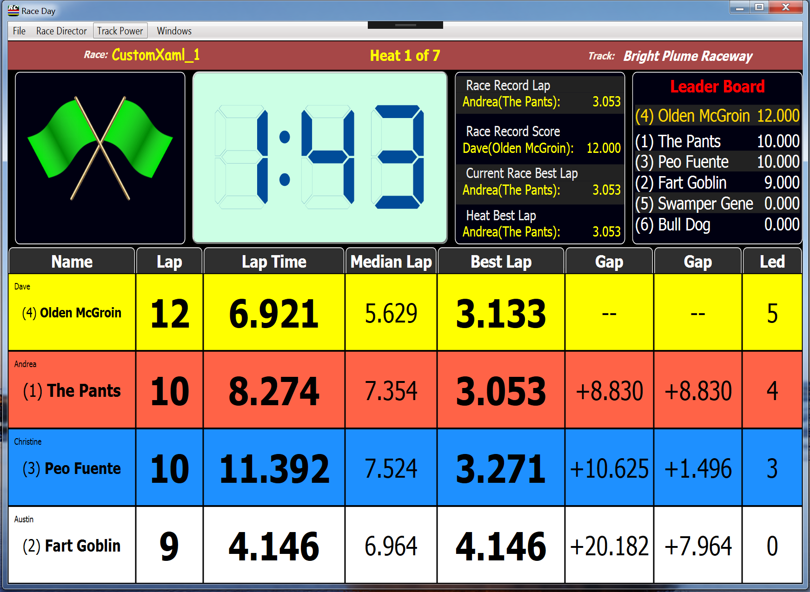
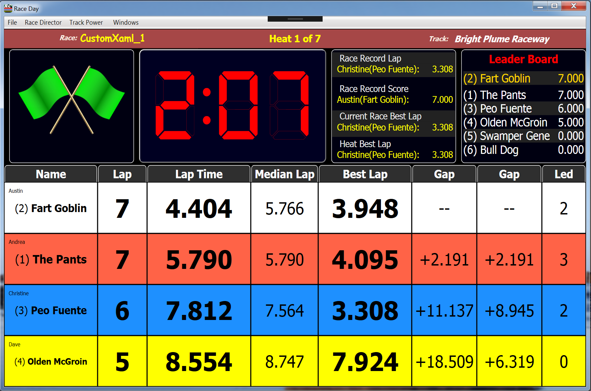
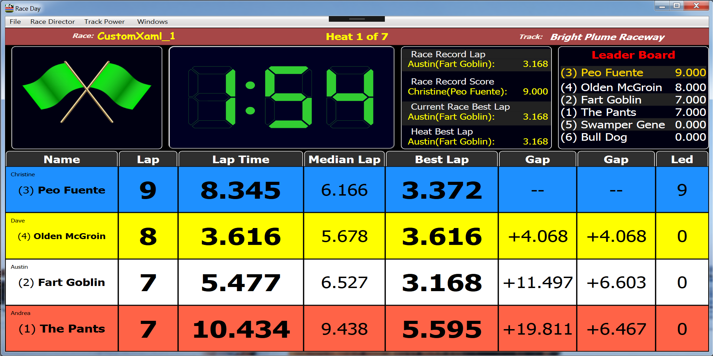

# Creator (April 2020)
Fede Ferrero fedeferrero00@libero.it  
Mauro Forno m.forno@tin.it

# Info
Custom race screen that supports 4 lanes

## _RD
These xaml files require custom text to display properly.  Simply copy the include [custom.json](./custom_text/custom.json) file to your <install directory>/data/Languages directory.  If you already have a custom.json file you should add these entries into your existing custom.json file so you do not overwrite your existing customizations.  
To find your <install_dir> simply go to the Race Day Setup screen and use the File->Open Install Folder menu option.

## Fonts
These xaml files require fonts that may not exist on your Windows system.  Download the 3 [fonts](./fonts) and double click each one to install them.  
* [Digit-Black.ttf](./fonts/Digit-Black.ttf)
* [Digit-Light.ttf](./fonts/Digit-Light.ttf)
* [Digit.ttf](./fonts/Digit.ttf)

## Screens
**Note: There's only one xaml file.**  
To achieve the look in the other two screenshots, you must change the font being used (I think).  Feel free to change it and do a pull request for the new xaml

[4 Lane](./xaml/Custom2GreenLED_4L.xaml)
