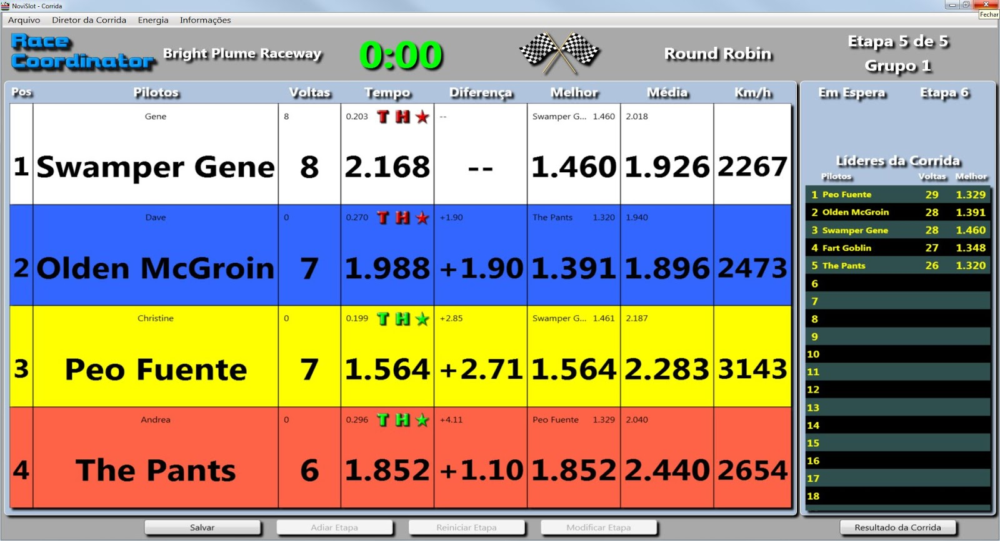

# Creator (December 2019)
Novi Slot
https://novislot.blogspot.com/2017/01/RC-Janelas.de.corridas.html
http://novislot.ueuo.com/download.html

# Info
Custom race screen that supports 1-8 lanes in any supported race configuration

## _RD
These xaml files require custom text to display properly.  Simply copy the include [custom.json](./custom_text/custom.json) file to your <install directory>/data/Languages directory.  If you already have a custom.json file you should add these entries into your existing custom.json file so you do not overwrite your existing customizations.  
To find your <install_dir> simply go to the Race Day Setup screen and use the File->Open Install Folder menu option.

## Screens
It is suggested that you take all files in the xaml folder.  This will give you 1-8 lane support and provide race result and other window support in the same theme.

[xaml files](./xaml)
