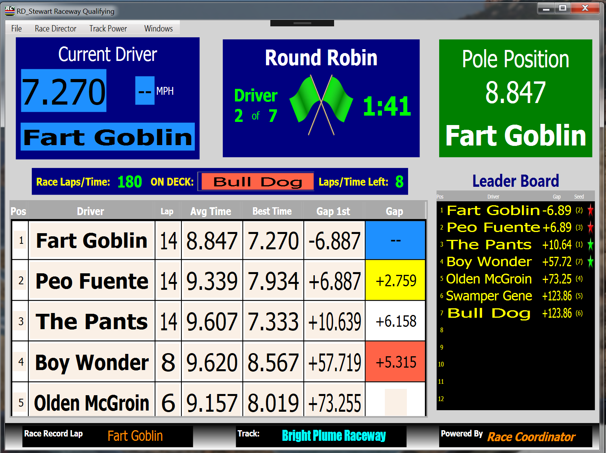
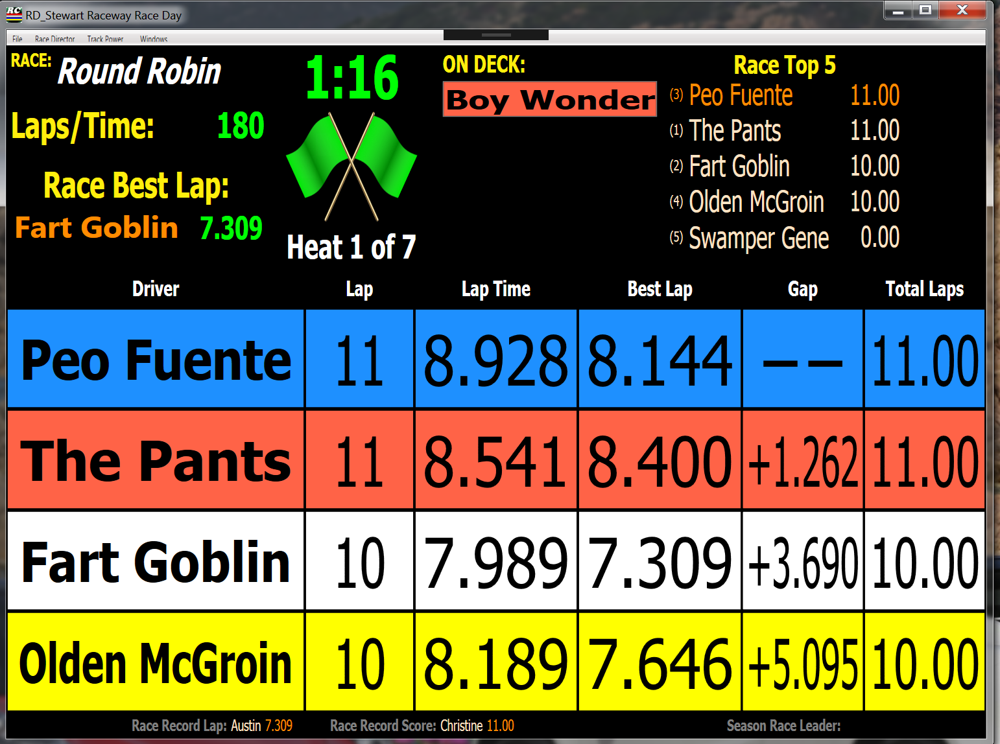
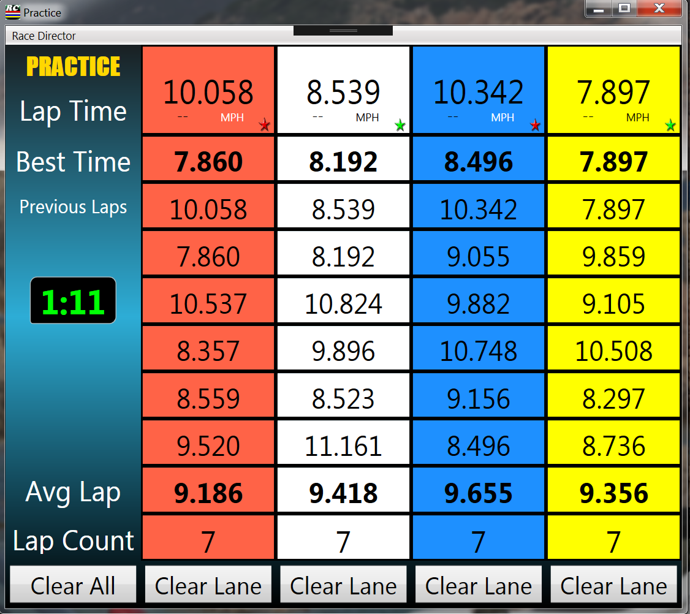

Creator: Steve Stewart
——————————————————————

Each of these 3 xaml files require custom text to display properly.  Simply copy the include "custom.json" file to your <install directory>/data/Languages directory.  If you already have a custom.json file you should add these entries into your existing custom.json file so you do not overwrite your existing customizations.

To find your <install_dir> simply go to the Race Day Setup screen and use the File->Open Install Folder menu option.  

