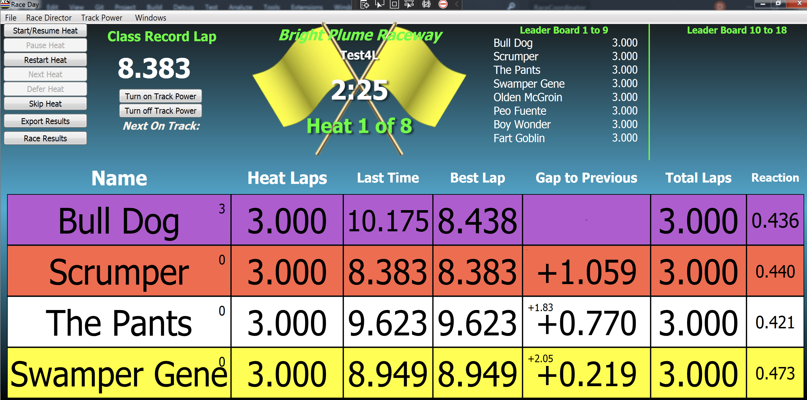
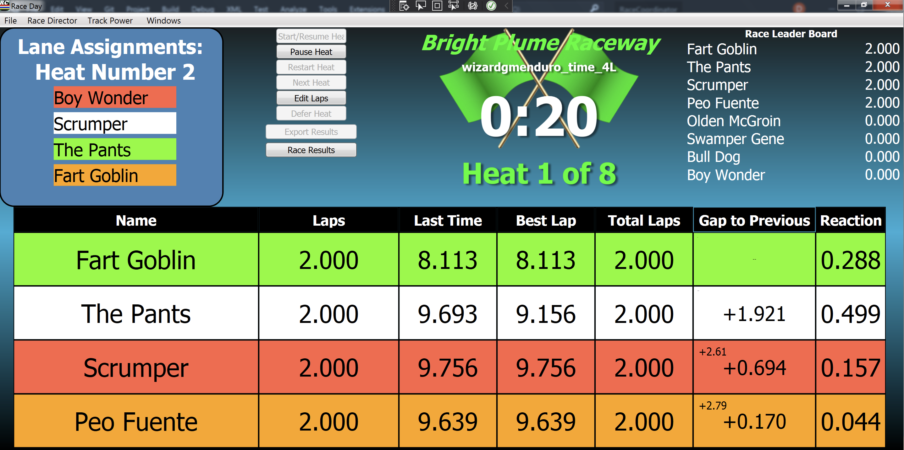
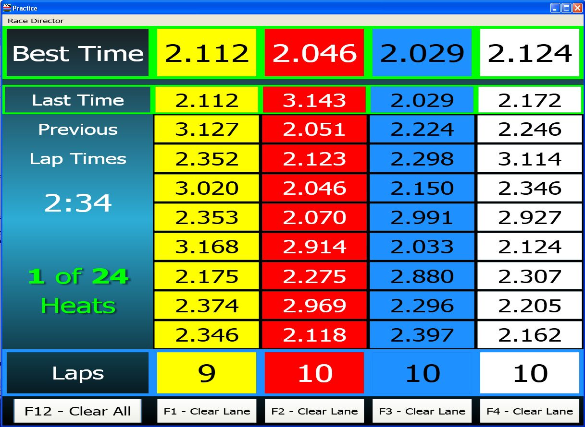
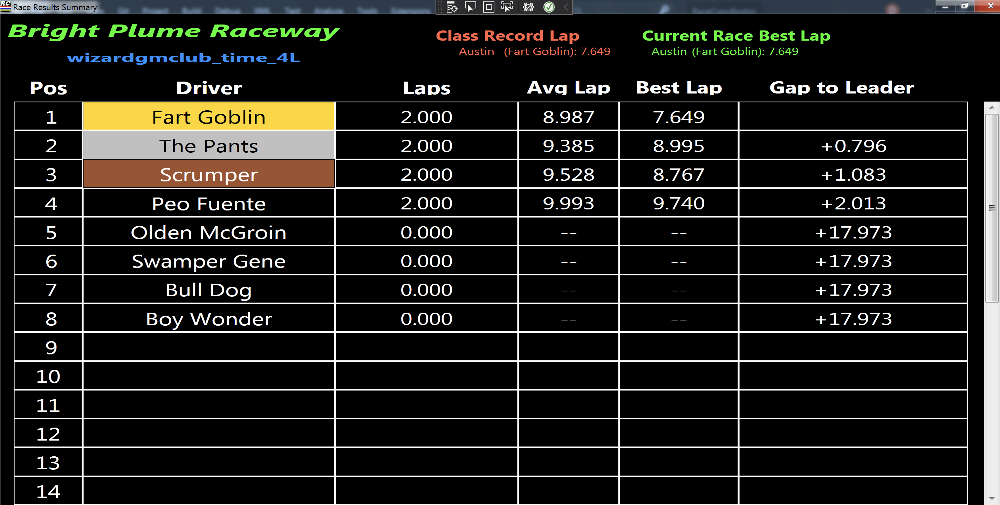
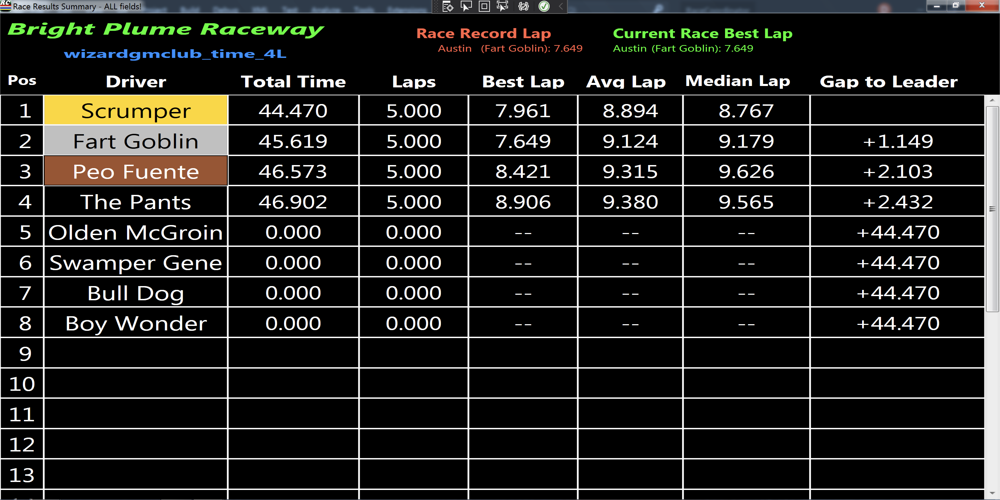

# Creator (December 2024)
Dennis M  - aka Wizardgm on Auslot forum

# Info
4 Lane Race Day screen  

Small numbers in each column are as follows:
* Name -- Laps led
* Gap to Previous -- Gap to Leader  

## Original info PDF
[Race Day Description](./RaceCoordinator-4Lane.pdf)

**Note: The race day files use custom race result files.**  Things will work automatically if you simply drop all the RaceCoodinatorCommunity files into your <install directory>/data folder.  
ex: c:\Program Files\RaceCoordinator\data\RaceCoordinatorCommunity  

To find your <install_dir> simply go to the Race Day Setup screen and use the File->Open Install Folder menu option.  

## _RD
Each of these xaml files require custom text to display properly.  Simply copy the include [custom.json](./custom_text/custom.json) file to your <install directory>/data/Languages directory.  If you already have a custom.json file you should add these entries into your existing custom.json file so you do not overwrite your existing customizations.

To find your <install_dir> simply go to the Race Day Setup screen and use the File->Open Install Folder menu option.  

# Screens
## Race Screen (club)

[Race Day 4 Lane](./xaml/Club-Time_4L.xaml)

## Race Screen (enduro)

[Race Day 4 Lane](./xaml/Enduro-Time_4L.xaml)

## Practice
See [Practice format](./Practice_setup.pdf) for information on how these practice files might be used to manage a large practice session.

[Practice 4 Lane](./xaml/wizardgmPractice_4L.xaml)
[Practice 6 Lane](./xaml/wizardgmPractice_6L.xaml)
[Practice 8 Lane](./xaml/wizardgmPractice_8L.xaml)

## Race Results Laps

[Race Results All Fields](./xaml/RaceResults-ALL.xaml)

## Race Results All Fields

[Race Results All Fields](./xaml/RaceResults-ALL.xaml)

